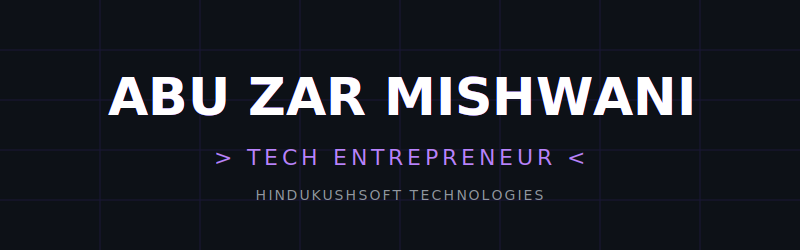

<!-- ═══════════════════════════════════════════════════════════════════ -->
<!--                    ABU ZAR MISHWANI — GITHUB PROFILE              -->
<!-- ═══════════════════════════════════════════════════════════════════ -->

<div align="center">

<!-- CUSTOM CYBERPUNK ANIMATED SVG HEADER -->


<br /><br />

<!-- SOCIAL LINKS — Minimal flat square style -->
[](https://mishwani.is-a.dev)
&nbsp;
[](https://www.hindukushsoft.com)
&nbsp;
[](mailto:ceo@hindukushsoft.com)
&nbsp;
[](https://www.fiverr.com/users/hindukushsoft/)

<br />

[](https://linkedin.com/in/mishwani7)
&nbsp;
[](https://www.facebook.com/abuzar.mishwani)
&nbsp;
[](https://instagram.com/abuzar.mishwani)
&nbsp;
[](https://twitter.com/itsabuzarr)

</div>

<br />

<!-- ═══════════════════════ TERMINAL BIO ═══════════════════════ -->

```js
// abuzar-mishwani.config.js

const abu_zar = {
    role:       "Founder, CEO & Lead Developer",
    company:    "HindukushSoft Technologies Pvt. Ltd.",
    location:   "Chitral, Pakistan",
    education: {
        current:  "M.Phil in Computer Science (In Progress)",
        degree:   "BS Computer Science — University of Chitral (2020–2024)",
    },
    expertise:  ["Enterprise Systems", "Government Digitization", "AI Integration"],
    platforms:  ["Fiverr Vetted Pro"],
    side:       ["TechABU Blog", "Spot Web Tools (190+ tools)"],
    motto:      "Build things that matter. Ship things that last.",
};
```

<br />

<!-- ═══════════════════════ DIVIDER ═══════════════════════ -->


<br />

<!-- ═══════════════════════ TECH STACK ═══════════════════════ -->

<div align="center">

### `⟨/⟩` Tech Stack

<br />

<!-- Languages -->


<!-- Frontend -->


<!-- Backend & DB -->


<!-- Mobile -->


<!-- Tools -->


</div>

<br />

<!-- ═══════════════════════ DIVIDER ═══════════════════════ -->


<br />

<!-- ═══════════════════════ PROJECTS ═══════════════════════ -->

### `📦` Projects I Lead

> As CEO & Lead Developer at **HindukushSoft Technologies**, I architect and build production systems that serve thousands of users.

<br />

<details open>
<summary><b>🏛️ Digitization of Model Farm Services Center — Khyber Pakhtunkhwa</b></summary>

<br />

```
┌─────────────────────────────────────────────────────────────────┐
│  Role:    Lead Developer                                        │
│  Status:  ☑️ Production                                          │
│  Stack:   React · TypeScript · Laravel · MySQL · Vite            │
│  Live:    https://mfsckp.com                                     │
└─────────────────────────────────────────────────────────────────┘
```

A massive production-grade enterprise MIS for the Agriculture Department.
Currently rolling out across **all 38 districts of Khyber Pakhtunkhwa** under the Government of KP.

[](https://mfsckp.com)

</details>

<details>
<summary><b>📱 GPA Calculator & Planner</b></summary>

<br />

```
┌─────────────────────────────────────────────────────────────────┐
│  Role:    Solo Developer                                         │
│  Status:  ☑️ Production — #1 Worldwide on Android                │
│  Stack:   Kotlin · Jetpack Compose · Material 3                  │
│  Users:   50,000+ Downloads                                      │
└─────────────────────────────────────────────────────────────────┘
```

The #1 GPA Calculator app globally on Android. Custom grading scales, semester planning,
target GPA forecasting, and professional PDF reporting.

[](https://play.google.com/store/apps/details?id=advc.calc.easygpacalculator&hl=en)

</details>

<details>
<summary><b>🍽️ Cibao Grille</b></summary>

<br />

```
┌─────────────────────────────────────────────────────────────────┐
│  Role:    Lead Developer                                         │
│  Status:  ☑️ Production                                          │
│  Stack:   Next.js · Payload CMS · TypeScript                     │
│  Client:  Naples, Florida                                        │
└─────────────────────────────────────────────────────────────────┘
```

Full-stack web platform for a fine dining restaurant. Dynamic menu management,
CMS-powered content, and polished brand experience.

[](https://cibaogrille.com)

</details>

<details>
<summary><b>🏨 Hotel Innjigaan</b></summary>

<br />

```
┌─────────────────────────────────────────────────────────────────┐
│  Role:    Lead Developer                                         │
│  Status:  ☑️ Production                                          │
│  Stack:   React.js · TypeScript · Vite · Tailwind CSS            │
│  Client:  Chitral, Pakistan                                      │
└─────────────────────────────────────────────────────────────────┘
```

Custom hospitality website with room showcases, booking inquiries, gallery,
and integrated desktop hotel management software.

[](https://innjigaan.com)

</details>

<details>
<summary><b>💻 Inventro POS</b></summary>

<br />

```
┌─────────────────────────────────────────────────────────────────┐
│  Role:    Lead Developer                                         │
│  Status:  ☑️ Production                                          │
│  Stack:   Electron · React · TypeScript · SQLite                 │
│  Type:    Desktop Application                                    │
└─────────────────────────────────────────────────────────────────┘
```

Desktop POS and inventory management system for retail businesses.
Billing, supplier management, khaata management, expense tracking, and role-based access.

[](https://inventro.hindukushsoft.com)

</details>

<br />

<!-- ═══════════════════════ DIVIDER ═══════════════════════ -->


<br />

<!-- ═══════════════════════ GITHUB STATS ═══════════════════════ -->

<div align="center">

### `📊` GitHub Analytics

<br />

<picture>
  <source media="(prefers-color-scheme: dark)" srcset="https://github-readme-stats.vercel.app/api?username=abuzar-mishwani&show_icons=true&hide_border=true&bg_color=0d1117&title_color=b882fc&icon_color=6634f1&text_color=c9d1d9&ring_color=6634f1" />
  <source media="(prefers-color-scheme: light)" srcset="https://github-readme-stats.vercel.app/api?username=abuzar-mishwani&show_icons=true&hide_border=true&bg_color=ffffff&title_color=6634f1&icon_color=b882fc&text_color=333333" />
  
</picture>
&nbsp;
<picture>
  <source media="(prefers-color-scheme: dark)" srcset="https://streak-stats.demolab.com/?user=abuzar-mishwani&hide_border=true&background=0d1117&ring=6634f1&fire=b882fc&currStreakLabel=b882fc&sideLabels=c9d1d9&dates=555555" />
  <source media="(prefers-color-scheme: light)" srcset="https://streak-stats.demolab.com/?user=abuzar-mishwani&hide_border=true&background=ffffff&ring=6634f1&fire=b882fc&currStreakLabel=6634f1&sideLabels=333333&dates=888888" />
  
</picture>

<br /><br />

<picture>
  <source media="(prefers-color-scheme: dark)" srcset="https://github-readme-stats.vercel.app/api/top-langs/?username=abuzar-mishwani&layout=compact&hide_border=true&bg_color=0d1117&title_color=b882fc&text_color=c9d1d9&langs_count=8" />
  <source media="(prefers-color-scheme: light)" srcset="https://github-readme-stats.vercel.app/api/top-langs/?username=abuzar-mishwani&layout=compact&hide_border=true&bg_color=ffffff&title_color=6634f1&text_color=333333&langs_count=8" />
  
</picture>

</div>

<br />

<!-- ═══════════════════════ DIVIDER ═══════════════════════ -->


<br />

<!-- ═══════════════════════ ACTIVITY GRAPH ═══════════════════════ -->

<div align="center">

### `📈` Contribution Graph

<br />

[](https://github.com/abuzar-mishwani)

</div>

<br />

<!-- ═══════════════════════ FOOTER ═══════════════════════ -->

<div align="center">

```
 ╔═════════════════════════════════════════════════════════════════╗
 ║  "Build things that matter. Ship things that last."            ║
 ║                                                                ║
 ║       Founder & CEO — HindukushSoft Technologies Pvt. Ltd.     ║
 ║       Chitral, Pakistan 🇵🇰                                     ║
 ╚═════════════════════════════════════════════════════════════════╝
```

<br />


</div>
